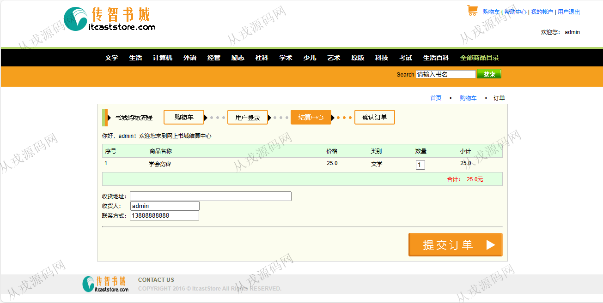
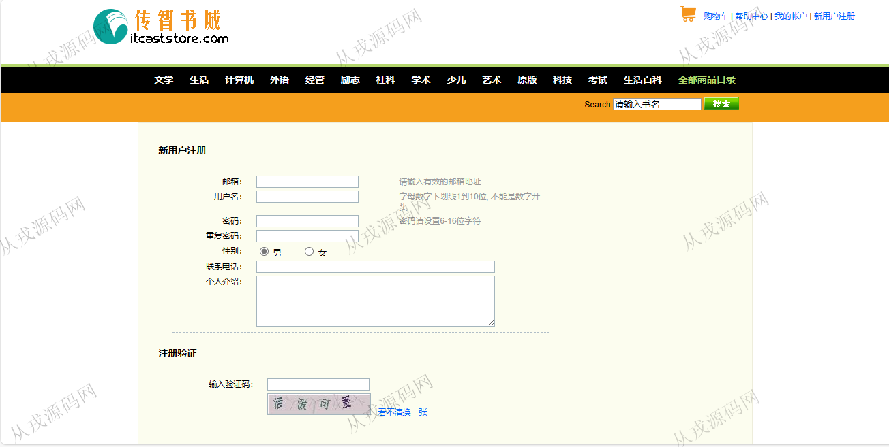
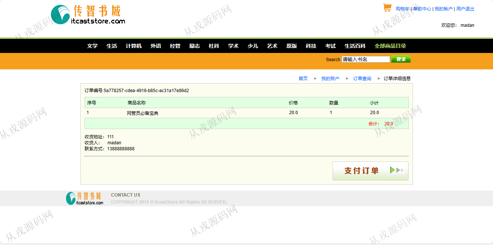
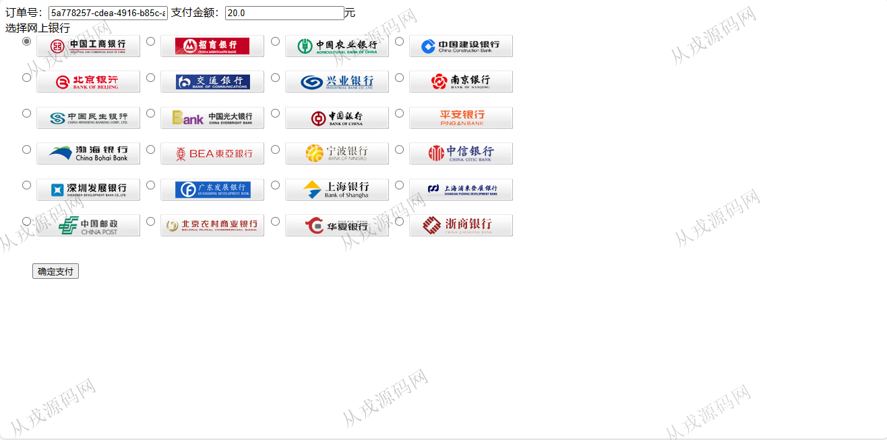
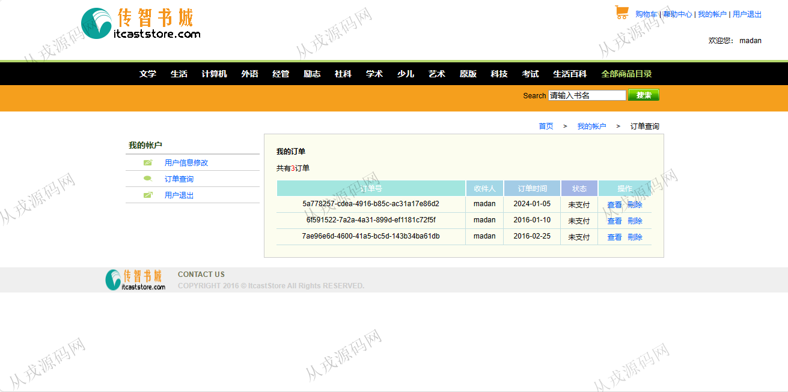
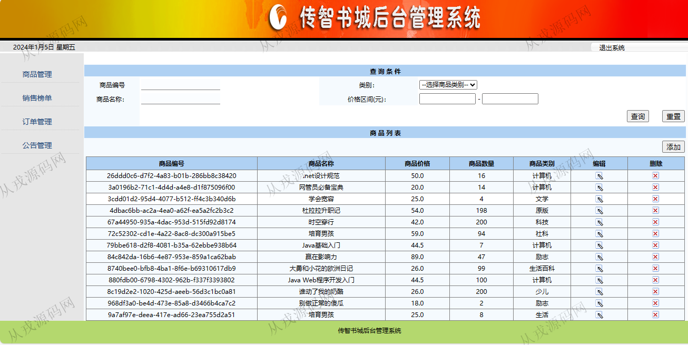
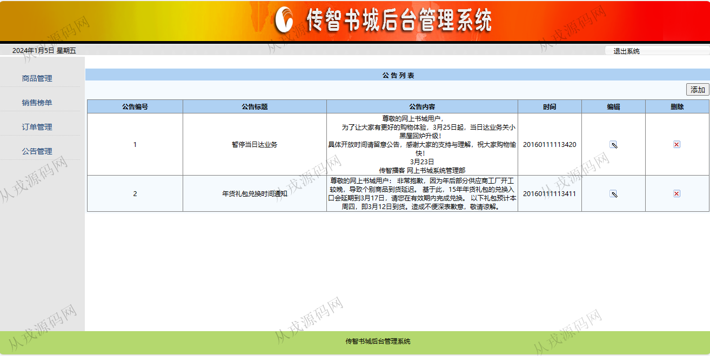

<h1 align="center">106.书城管理系统</h1>

 获取sql文件 QQ: 386869957 QQ群: 377586148 

 [推荐站点: 从戎源码网](https://armycodes.com/) 

## 简介

> 本代码来源于网络,仅供学习参考使用!
>
> 提供1.远程部署/2.修改代码/3.设计文档指导/4.框架代码讲解等服务
> 
> 访问地址：http://localhost:8080/
> 
> 登录地址：http://localhost:8080/client/login.jsp
> 
> 用户：madan 123456
> 
> 管理员：admin 123456
>

## 项目介绍
基于jsp+servlet的书城管理系统：前端 jsp、jquery，后端 servlet，角色分为管理员、用户；集成商品购买、商品管理、订单管理、公告管理等功能于一体的系统。

## 功能介绍

### 用户

- 基本功能：登录、注册、退出
- 网站首页：主导航栏，全局搜索，轮播图，公告版，本周热卖
- 商品购买：分类导航，图书列表展示，图书详情，购买，购物车，结账，填收货地址，在线支付
- 我的账户：用户信息查看与修改，订单查询，订单删除，订单详情

### 管理员

- 商品管理：商品信息的增删改查，多条件搜索查询
- 销售榜单：输入年份和月份，点击下载csv表格的榜单数据
- 订单管理：查询前台用户下单数据，订单详情，订单删除
- 公告管理：公告信息的增删改查

## 环境

- <b>IntelliJ IDEA 2021.3</b>

- <b>Mysql 5.7.26</b>

- <b>Tomcat 7.0.73</b>

- <b>JDK 1.8</b>

## 运行截图

